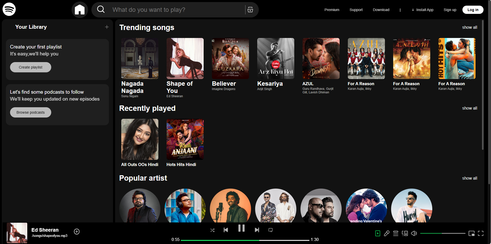

# Spotify-Clone

Welcome to the SpotifyClone repository! This project aims to recreate the frontend and user experience of the popular music streaming service, Spotify, within a web-based platform. This project was designed to improve my skills in front-end web development. I used HTML and CSS to design and style the interface, and I implemented JavaScript to handle the sliding for music cards. This README file will provide you an overview of the project and contribution guidelines.

> **Note**: This is not a Responsive web-App. It is only perfectly open on laptop screen.

---

## 🛠 Technologies Used

- Frontend: **HTML, CSS, JavaScript**

---

## 📚 How to Use

1. Clone the repository:

```bash
git clone https://github.com/hariom045418/Spotify-Clone.git
```
2. Open index.html in your browser.

🚀 Click Here to Demo:

👉 Live Demo Link

 https://hariom045418.github.io/Spotify-Clone/

🖼️ Preview of Spotify Clone:

 

Contribution Guidelines

We welcome contributions from the community to improve and enhance the SpotifyClone project. If you're interested in contributing, please follow these guidelines:

- Fork the repository and create a new branch for your feature or bug fix.

- Ensure your code follows the existing coding style and conventions.

- Write clear and concise commit messages.

- Test your changes thoroughly.

- Submit a pull request detailing the changes you’ve made and why they are necessary.

Thank you for your interest in the SpotifyClone project! If you have any questions or feedback, please don’t hesitate to reach out to us. Happy coding!